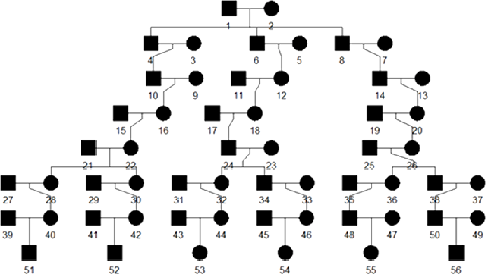

# GRAPE – Genomic relatedness detection pipeline

## Description

GRAPE is an open-source end-to-end Genomic RelAtedness detection PipelinE.

It requires a single multisamples VCF file as input and has a separate workflow for downloading and checking the integrity of reference datasets.

GRAPE incorporates comprehensive data preprocessing, quality control (QC), and several workflows for relatedness inference.

<p align="center">
    
</p>

## Installation

```bash
docker build -t genx_relatives:latest -f containers/snakemake/Dockerfile -m 8GB .
```

The pipeline has three main steps:
1. Downloading of the reference datasets.
2. Quality control and data preprocessing.
3. Application of the relationship inference workflow.

The pipeline is implemented with the [Snakemake framework](https://snakemake.github.io/) and can be accessible through the `snakemake` command.

All the pipeline functionality is embedded into the GRAPE launcher: `launcher.py`, that invokes Snakemake under the hood.
By default, all the commands just check the accessibility of the data and build the computational graph.

To actually perform computation one should add `--real-run` flag to all the commands.

## Downloading the Reference Datasets

This step only needs to be done once.

To download reference dataset one should use `reference` command of the pipeline launcher.

The command below downloads needed references to the directory specified by the flag `--ref-directory`.
After that `--ref-directory` argument should be used in all subsequent commands.

```bash
docker run --rm -it -v /media:/media -v /etc/localtime:/etc/localtime:ro \
    genx_relatives:latest launcher.py reference --ref-directory /media/ref --real-run
```

If phasing and imputation are required (mainly for the GERMLINE workflow) one should specify additional `--phase` and `--impute` flags to previous command to download additional reference datasets.

Total amount of required disk space must be at least **50GB**.

```bash
docker run --rm -it -v /media:/media -v /etc/localtime:/etc/localtime:ro \
    genx_relatives:latest launcher.py reference \
        --ref-directory /media/ref --phase --impute --real-run
```

There are another options to download all required reference data as a single file.
This file is prepared by GenX team and preloaded on our side in the cloud.

It can be done by specifying additional flag `--use-bundle` to the `reference` command.
This way is faster, since all the post-processing procedures have been already performed.

```bash
docker run --rm -it -v /media:/media -v /etc/localtime:/etc/localtime:ro \
    genx_relatives:latest launcher.py reference --use-bundle \
        --ref-directory /media/ref --phase --impute --real-run
```

## Quality Control and Data Preprocessing

GRAPE have a versatile and configurable preprocessing workflow.
One part of the preprocessing is required and must be performed before the relationship inference workflow.

Preprocessing is launched by the `preprocess` command of the GRAPE.
Along with some necessary technical procedures, preprocessing includes the following steps.

* **[Required] SNPs quality control by minor allele frequency (MAF) and the missingness rate**.
    We discovered that blocks of rare SNPs with low MAF value in genotype arrays may produce false positive IBD segments.
    To address this problem, we filter SNPs by minor allele frequency.
    We remove SNPs with MAF value less than 0.02.
    Additionally, we remove multiallelic SNPs, insertions / deletions, and SNPs with the high missingness rate, because such SNPs are inconsistent with IBD detection tools.

* **[Required] Per-sample quality control, using missingness and heterozygosity**.
    Extensive testing revealed that samples with an unusually low level of heterozygosity could produce many false relatives matches among individuals.
    GRAPE excludes such samples from the analysis and creates a report file with the description of the exclusion reason.

* **[Required] Control for strands and SNP IDs mismatches**.
    During this step GRAPE fixes inconsistencies in strands and reference alleles.

* **[Optional] LiftOver from hg38 to hg37**.
    Currently GRAPE uses hg37 build version of the human genome reference.
    The pipeline supports input in hg38 and hg37 builds (see `--assembly` flag of the pipeline launcher).
    If hg38 build is selected (`--assembly h38`), then GRAPE applies liftOver tool to the input data in order to match the hg37 reference assembly.

* **[Optional] Phasing and imputation**.
    GRAPE supports phasing and genotype imputation using 1000 Genomes Project reference panel.
    GERMLINE IBD detection tool requires phased data.
    So, if input data is unphased, one should include phasing (Eagle 2.4.1) (`--phase` flag) into the preprocessing before running the GERMLINE workflow.
    If input data is highly _heterogeneous_ in a sense of available SNPs positions, one can also add imputation (Minimac4) procedure to the preprocessing (`--impute` flag).

* **[Optional] Removal of imputed SNPs**.
    We found, that if input data is _homogeneous_ in a sense of SNPs positions, the presence of imputed SNPs does not affect the overall IBD detection accuracy of the IBIS tool, but it significantly slows down the overall performance.
    For this particular case, when input data initially contains a lot of imputed SNPs, we recommend to remove them by specifying `--remove-imputation` flag to the GRAPE launcher.
    GRAPE removes all SNPs which are marked with `IMPUTED` flag in the input VCF file.

### Usages

1. Preprocessing for the IBIS + KING relatedness inference workflow.
    - Input file is located at `/media/input.vcf.gz`.
    - GRAPE working directory is `/media/data`.
    - Assembly of the input VCF file is `hg37`.

```bash
docker run --rm -it -v /media:/media -v /etc/localtime:/etc/localtime:ro \
    genx_relatives:latest launcher.py preprocess --ref-directory /media/ref \
        --vcf-file /media/input.vcf.gz --directory /media/data --assembly hg37 --real-run
```

2. Preprocessing for the GERMLINE + KING workflow.
    - Assembly of the input VCF file is `hg38`.
    - GERMLINE can work with phased data only, so we add phasing procedure to the preprocessing.
    - Genotype imputation is also added.

```bash
docker run --rm -it -v /media:/media -v /etc/localtime:/etc/localtime:ro \
    genx_relatives:latest launcher.py preprocess --ref-directory /media/ref \
        --vcf-file /media/input.vcf.gz --directory /media/data \
        --assembly hg38 --phase --impute --real-run
```

## GRAPE Relatedness Inference Workflows

There are _three_ relationship inference workflows implemented in GRAPE.

These workflows are activated by the `find` command of the launcher.

Workflow selection is made by the `--flow` parameter.

1. **IBIS + ERSA**, `--flow ibis`.
    During this workflow IBD segments detection is performed by IBIS, and estimation of relationship degree is carried out by means of ERSA algorithm.
    This is the fastest workflow.
2. **IBIS + ERSA & KING**, `--flow ibis-king`.
    During this workflow, GRAPE uses KING tool for the first 3 degrees of relationships, and IBIS + ERSA approach for higher order degrees.
3. **GERMLINE + ERSA & KING**, `--flow germline-king`.
    The workflow uses GERMLINE for IBD segments detection.
    KING is used to identify relationship for the first 3 degrees, and ERSA algorithm is used for higher order degrees.
    This workflow was added to GRAPE mainly for the case, when input data is already phased and accurately preprocessed.

### Usages

1. Relationship inference with the IBIS + ERSA & KING workflow.

```bash
docker run --rm -it -v /media:/media -v /etc/localtime:/etc/localtime:ro \
    genx_relatives:latest launcher.py find --flow ibis-king --ref-directory /media/ref \
        --directory /media/data --ibis-seg-len 7 --ibis-min-snp 500 \
        --zero-seg-count 0.5 --zero-seg-len 5.0 --alpha 0.01 --real-run
```

2. Relationship inference with GERMLINE + ERSA \& KING workflow.

```bash
docker run --rm -it -v /media:/media -v /etc/localtime:/etc/localtime:ro \
    genx_relatives:latest launcher.py find --flow germline-king --ref-directory /media/ref \
        --directory /media/data --zero-seg-count 0.5 --zero-seg-len 5.0 \
        --alpha 0.01 --real-run
```

## Description of the IBIS and ERSA Parameters

* **[IBIS]** `--ibis-seg-len`.
    Minimum length of the IBD segment to be found by IBIS.
    Higher values reduce false positive rate and give less distant matches (default = 7 cM).
* **[IBIS]** `--ibis-min-snp`.
    Minimum number of SNPs per IBD segment to be detected (default = 500 SNPs).
* **[ERSA]** `--zero-seg-count`.
    Mean number of shared segments for two unrelated individuals in the population.
    Smaller values tend to give more distant matches and increase the false positive rate (default = 0.5).
* **[ERSA]** `--zero-seg-len`.
    Average length of IBD segment for two unrelated individuals in the population.
    Smaller values tend to give more distant matches and increase the false positive rate (default = 5 cM).
* **[ERSA]** `--alpha`.
    ERSA significance level (default = 0.01).

## Description of the Output Relatives File

Output relatives file is in TSV file format.
It contains one line for each detected pair of relatives.

```text
id1      id2     king_degree king_relation shared_genome_proportion kinship kinship_degree ersa_degree ersa_lower_bound ersa_upper_bound shared_ancestors final_degree  total_seg_len        seg_count
g1-b1-i1 g2-b1-i1     1           PO                0.4996          0.2493      1.0             1               1               1               0.0             1       3359.9362945470302      40
g1-b1-i1 g2-b2-i1     1           PO                0.4997          0.2459      1.0             1               1               1               0.0             1       3362.012253715002       40
g1-b1-i1 g2-b3-i1     1           PO                0.4999          0.2467      1.0             1               1               1               0.0             1       3363.150814131464       40
g1-b1-i1 g3-b1-i1     2           2                 0.2369          0.1163      2.0             2               2               2               1.0             2       1644.634182188072       60
```

 * `id1` - ID of the first sample in a pair of relatives.
 * `id2` - ID of the second sample in a pair of relatives, `id1` is always less than `id2`.
 * `king_degree` - Numeric degree of relationship estimated by KING;
    - `0` means duplicates or MZ twins,
    - `1` means parent-offspring (PO),
    - `2` can be either full siblings (FS), half siblings and grandmother/grandfather with a granddaughter/grandson.
    - `3` is aunt/uncle with a niece/nephew, as described in table in https://en.wikipedia.org/wiki/Coefficient_of_relationship.

    If `king_degree` exists, then `final_degree` will be equal to `king_degree`.
 * `king_relation` - further differentiation for the first 2 degrees of KING; `king_degree` equals `1` means PO - parent-offspring, also KING detects FS in some of second degrees.
 * `shared_genome_proportion` is the approximate fraction of genome shared by two individuals.
    It should be approximately 0.5 for PO and FS, 0.25 for grandmother-granddaughter and half-siblings.
    For the first 3 degrees it is calculated as total length of IBD2 segments + half of total length of IBD1 segments.
    For 4th+ degrees it is simply half of total length of IBD1 segments.
 * `kinship` is the KING kinship coefficient.
 * `ersa_degree` is the degree estimated from IBD segments by ERSA, it is used for the `final_degree` when `king_degree` does not exist.
 * `ersa_lower_bound` / `ersa_upper_bound` is the lower / upper bound of the degree estimated by the ERSA using confidence interval corresponding to the significance level &alpha; (`--alpha`).
    Accordingly to the ERSA likelihood model, true degree does not belong to this interval with probability equals to &alpha;.
 * `shared_ancestors` is the most likeliest number of shared ancestors.
    If it equals `0`, then one relative is a direct descendant of the other; if equals `1`, then they most probably have one common ancestor and represent half siblings; if equals `2`, then, for examples, individuals may have common mother and father.
 * `final_degree` is the final relationship degree predicted by GRAPE.
    If KING is used (`--flow ibis-king` or `--flow germline-king`), it equals `king_degree` for close relatives up to the 3rd degree, and `ersa_degree` for distant relatives.
 * `total_seg_len` is the total length of all IBD1 segments.
    It's calculated using IBIS or GERMLINE IBD data.
    If KING is involved, then for the first 3 degrees it's calculated using KING IBD data.
 * `seg_count` is the total number of all IBD segments found by IBIS / GERMLINE tools.
    If KING is involved, the total number of found IBD segments is taken from KING for the first 3 degrees.

## IBD Segments Weighting

Distribution of IBD segments among non-related (background) individuals within a population may be quite heterogeneous.
There may exist genome regions with extremely high rates of overall matching, which are not inherited from the recent common ancestors.
Instead, these regions more likely reflect other demographic factors of the population.

The implication is that IBD segments detected in such regions are expected to be less useful for estimating recent relationships.
Moreover, such regions potentially prone to false-positive IBD segments.

GRAPE provides two options to address this issue.

The <ins>first</ins> one is based on genome regions exclusion mask, wherein some genome regions are completely excluded from the consideration.
This approach is implemented in ERSA and is used by GRAPE by default.

The <ins>second</ins> one is based on the IBD segments weighing.

The key idea is to down-weight IBD segment, i.e. reduce the IBD segment length, if the segment cross regions with high rate of matching.

Down-weighted segments are then passed to the ERSA algorithm.

GRAPE provides an ability to compute the weight mask from the VCF file with presumably unrelated individuals.
This mask is used during the relatedness detection by specifying the `--weight-mask` flag of the launcher.

See more information in out [GRAPE preprint](https://www.biorxiv.org/content/10.1101/2022.03.11.483988v1).

### Computation of the IBD segments weighing mask

```bash
docker run --rm -it -v /media:/media \
    genx_relatives:latest launcher.py compute-weight-mask \
        --directory /media/background --assembly hg37 \
        --real-run --ibis-seg-len 5 --ibis-min-snp 400
```
The resulting files consist of a weight mask file in JSON format and a visualization of the mask stored in `/media/background/weight-mask/` folder.

### Usage of the IBD segments weighing mask

```bash
docker run --rm -it -v /media:/media \
    genx_relatives:latest launcher.py find --flow ibis --ref-directory /media/ref \
        --weight-mask /media/background/weight-mask/mask.json \
        --directory /media/data --assembly hg37 \
        --real-run --ibis-seg-len 5 --ibis-min-snp 400
```

## Execution by Scheduler
The pipeline can be executed using lightweight scheduler [Funnel](https://ohsu-comp-bio.github.io/funnel), which implements [Task Execution Schema](https://github.com/ga4gh/task-execution-schemas) developed by [GA4GH](https://github.com/ga4gh/wiki/wiki).

During execution, incoming data for analysis can be obtained in several ways: locally, FTP, HTTPS, S3, Google, etc.
The resulting files can be uploaded in the same ways.

It is possible to add other features such as writing to the database, and sending to the REST service.

The scheduler itself can work in various environments from a regular VM to a Kubernetes cluster with resource quotas support.

For more information see the [doc](https://ohsu-comp-bio.github.io/funnel/docs) .

How to use Funnel:

```text
# Start the Funnel server
/path/to/funnel server run

# Use Funnel as client
/path/to/funnel task create funnel/grape-real-run.json
```

## Launch with Dockstore

GRAPE supports execution with the Dockstore.

Dockstore page for the GRAPE pipeline can be found [here](https://dockstore.org/organizations/GenX/collections/GRAPE).


1. [Install dockstore](https://dockstore.org/quick-start).

2. Clone the GRAPE repository.

3. Download reference datasets.

   There are four available options:

```bash
# Download minimal reference datasets from public available sources (without phasing and imputation)
dockstore tool launch --local-entry workflows/reference/cwl/ref_min.cwl --json workflows/reference/cwl/config.json --script
```

```bash
# Download complete reference datasets from public available sources (for phasing and imputation)
dockstore tool launch --local-entry workflows/reference/cwl/ref.cwl --json workflows/reference/cwl/config.json --script
```

```bash
# Download minimal reference datasets as bundle from (without phasing and imputation)
dockstore tool launch --local-entry workflows/bundle/cwl/bundle_min.cwl --json workflows/reference/bundle/config.json --script
```

```bash
# Download complete reference datasets as bundle from (for phasing and imputation)
dockstore tool launch --local-entry workflows/bundle/cwl/bundle.cwl --json workflows/reference/bundle/config.json --script
```

4. Run the preprocessing.
```bash
dockstore tool launch --local-entry workflows/preprocess2/cwl/preprocess.cwl --json workflows/preprocess2/cwl/config.json --script
```

5. Run the relatedness inference workflow.
```bash
dockstore tool launch --local-entry workflows/find/cwl/find.cwl --json workflows/find/cwl/config.json --script
```

Each pipeline step requires `config.json`.

Each config has predefined directories and paths, but you can override these paths by changing them in these files.

Also notice that Dockstore saves its runtime in `datastore` directory.
This directory will grow up with each run.
We recommend to clean it up after each step, especially after reference downloading.

## Evaluation on Simulated Data

We added a simulation workflow into GRAPE to perform a precision / recall analysis of the pipeline.

It's accessible by `simulate` command of the pipeline launcher and incorporates the following steps:

1. Pedigree simulation with unrelated founders; we use the [Ped-sim](https://github.com/williamslab/ped-sim) simulation package.
2. Relatedness degrees estimation;
3. Comparison between true and estimated degrees.

The source dataset for the simulation is taken from CEU population data of 1000 Genomes Project.
As CEU data consists of trios, we picked no more than one member of each trio as a founder.

We also ran GRAPE on selected individuals to remove all cryptic relationships up to the 6th degree.

Then, we randomly assigned sex to each individual and used sex-specific genetic maps to take into account the differences in recombination rates between men and women.

A visualization of structure of simulated pedigree is given below:

<p align="center">
    
</p>

### How to Run Simulation

Use the `simulate` command of the GRAPE launcher.

```bash
docker run --rm -it -v /media:/media -v /etc/localtime:/etc/localtime:ro \
    genx_relatives:latest launcher.py simulate --flow ibis-king --ref-directory /media/ref \
        --directory /media/data --sim-params-file params/relatives_average.def \
        --sim-samples-file ceph_unrelated_all.tsv --assembly hg37 --ibis-seg-len 5 \
        --ibis-min-snp 400 --zero-seg-count 0.1 --zero-seg-len 5 --alpha 0.01 --real-run
```

### Precision / Recall Analysis

For each `i` degree of relationships we computed precision and recall metrics:

=\frac{\mathrm{TP}(i)}{\mathrm{TP}(i)+\mathrm{FP}(i)};\quad\mathrm{Recall}(i)=\frac{\mathrm{TP}(i)}{\mathrm{TP}(i)+\mathrm{FN}(i)}.)

Here TP(i), FP(i), FN(i) are the numbers of true positive, false positive, and false negative relationship matches predicted for the degree `i`.

In our analysis we used non-exact (fuzzy) interval metrics.

- For the 1st degree, we require an exact match.

- For the 2nd, 3rd, and 4th degrees, we allow a degree interval of ±1. For example, for the 2nd true degree we consider a predicted 3rd degree as a true positive match.

- For the 5th+ degrees, we use the ERSA confidence intervals which are typically 3-4 degrees wide.

- For 10th+ degrees, these intervals are 6-7 degrees wide.

<p align="center">
    
</p>

## Known Limitations

It is known that for some small isolated populations IBD sharing is very high.
Therefore, our pipeline overestimates the relationship degree for them.

It is not recommended to mix standard populations like CEU and the small populations like isolated native ones.

This problem is discussed in https://journals.plos.org/plosone/article?id=10.1371/journal.pone.0034267.

## Credits

License: GNU GPL v3

## Support

Join our Telegram chat for the support: https://t.me/joinchat/NsX48w4OzcpkNTRi.
