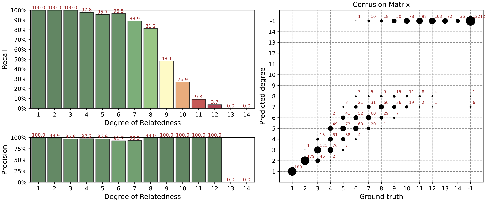

.. _sec-getting_started:

=======================================
Getting Started
=======================================

This section describes testing pipeline on simulated data. We recommend to
run **GRAPE** on the simulated dataset at first to confirm you that software
installed and function correctly.

Install **GRAPE** using one of the methods described in the

After installation return to the `Evaluation on Simulated Data`_ section.

Evaluation on Simulated Data
---------------------------------------

We added a simulation workflow into GRAPE to perform a precision / recall analysis of the pipeline.

It's accessible by `simulate` command of the pipeline launcher and incorporates the following steps:

#. Pedigree simulation with unrelated founders using the `ped-sim <https://github.com/williamslab/ped-sim>`_ simulation package.

   #. The source dataset for the simulation is taken from CEU population data of 1000 Genomes Project. As CEU data consists of trios, we picked no more than one member of each trio as a founder.
   #. All cryptic relationships up to the 6th degree is removed from selected samples using GRAPE.
   #. Sex of each sample is randomly assigned using sex-specific genetic maps to take into account the differences in recombination rates between men and women.
#. Relatedness degrees estimation;
#. Comparison between true and estimated degrees.

A visualization of simulated pedigree structure is given below:

.. image:: ./images/grape.simulated.pedigree.structure. png
   :width: 100%
   :alt: simulated pedigree structure
   :align: center

How to Run Simulation
---------------------------------------

Use the `simulate` command of the GRAPE launcher.

::

    docker run --rm -it -v /media:/media -v /etc/localtime:/etc/localtime:ro \
        genx_relatives:latest launcher.py simulate --flow ibis-king --ref-directory /media/ref \
            --directory /media/data --sim-params-file params/relatives_average.def \
            --sim-samples-file ceph_unrelated_all.tsv --assembly hg37 --ibis-seg-len 5 \
            --ibis-min-snp 400 --zero-seg-count 0.1 --zero-seg-len 5 --alpha 0.01 --real-run

Precision / Recall Analysis
---------------------------------------

For each `i` degree of relationships we computed precision and recall metrics:

.. math::

    ![\mathrm{Precision}(i) = \frac{\mathrm{TP}(i)}{\mathrm{TP}(i) + \mathrm{FP}(i)}; \quad \mathrm{Recall}(i) = \frac{\mathrm{TP}(i)}{\mathrm{TP}(i) + \mathrm{FN}(i)}]
..
    (https://latex.codecogs.com/svg.latex?\mathrm{Precision}(i)=\frac{\mathrm{TP}(i)}{\mathrm{TP}(i)+\mathrm{FP}(i)};\quad\mathrm{Recall}(i)=\frac{\mathrm{TP}(i)}{\mathrm{TP}(i)+\mathrm{FN}(i)}.)

Here TP(i), FP(i), FN(i) are the numbers of true positive, false positive, and false negative relationship matches predicted for the degree `i`.

In our analysis we used non-exact (fuzzy) interval metrics.

- For the 1st degree, we require an exact match.

- For the 2nd, 3rd, and 4th degrees, we allow a degree interval of ±1. For example, for the 2nd true degree we consider a predicted 3rd degree as a true positive match.

- For the 5th+ degrees, we use the ERSA confidence intervals which are typically 3-4 degrees wide.

- For 10th+ degrees, these intervals are 6-7 degrees wide.

Known Limitations
---------------------------------------

It is known that for some small isolated populations IBD sharing is very high.
Therefore, our pipeline overestimates the relationship degree for them.

It is not recommended to mix standard populations like CEU and the small populations like isolated native ones.

This problem is discussed in article `"Cryptic Distant Relatives Are Common
in Both Isolated and Cosmopolitan Genetic Samples" <https://journals.plos.org/plosone/article?id=10.1371/journal.pone.0034267>`_
by Brenna M. Henn et al.
