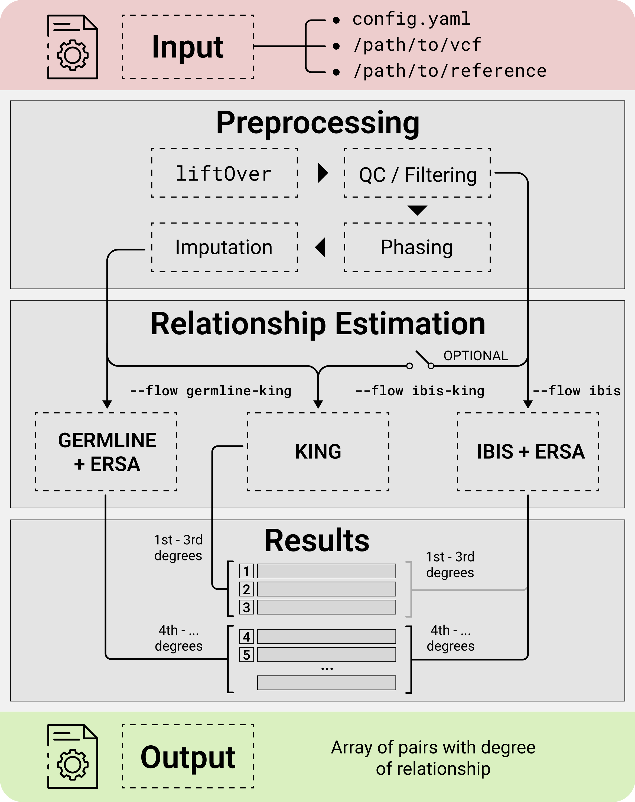

=======================================
GRAPE Overview
=======================================

Summary
----------
GRAPE is a free open-source Genomic RelAtedness detection PipelinE.

It is fast, reliable and accurate for both close and distant degrees of kinship.

GRAPE incorporates comprehensive data preprocessing, quality control (QC), reference datasets management, and several workflows for relatedness inference.

..  youtube:: cYa0S1MCdic
   :aspect: 16:9

The project uses software development best practices, as well as `Global Alliance for
Genomics and Health (GA4GH) <https://ga4gh.org/>`_ standards and tools. The GRAPE efficiency, methods and accuracy is demonstrated
on both simulated and real-world datasets in `F1000 Research Journal <https://f1000research.com/articles/11-589>`_.

Background
----------
Classifying the degree of relatedness between pairs of individuals has both scientific
and commercial applications. As an example, genome-wide association studies (GWAS)
may suffer from high rates of false positive results due to unrecognized population structure.
This problem becomes especially relevant with recent increases in large-cohort studies.
Accurate relationship classification is also required for genetic linkage analysis to
identify disease-associated loci. Additionally, DNA relatives matching service is one of
the leading drivers for the direct-to-consumer genetic testing market.

Despite the availability of scientific and research information on the methods for
determining kinship and the accessibility of relevant tools, the assembly of the pipeline,
that stably operates on a real-world genotypic data, requires significant research and
development resources. GRAPE is developed as an open-source project to address this isshue.

License
----------
GRAPE is free for both scientific and commercial purposes and licensed under GNU GPLv3.

Support
----------
Please report any issues or ideas at:
https://github.com/genxnetwork/grape/ishues

Join our `Telegram chat <https://t.me/joinchat/NsX48w4OzcpkNTRi>`_ for the support.

Or contact the team at: info@genxt.network

Contents:
---------

.. toctree::
   :maxdepth: 3

   getting_started
   installation
   howto
   dockstore
